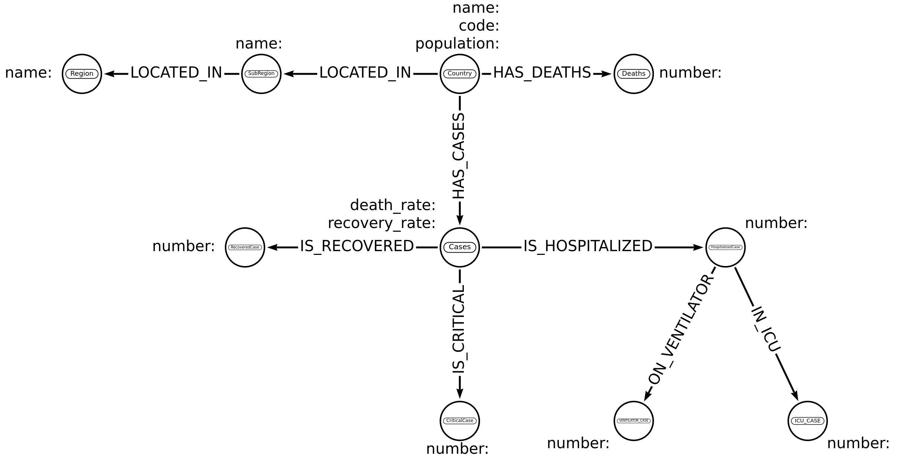

**SecondFront Data Exercise:**

To accomplish this exercise, I built a COVID-19 information sheet from 3 open source APIs to dig down into how COVID-19 affected different regions and subregions.

https://about-corona.net/documentation - Historical information per Country
https://covidtracking.com/data/api/version-2 - More information specific to the United States
https://fabian7593.github.io/CountryAPI - Information about different Countries including region.

The data model to be used in Neo4jcan be seen below:

To view the jupyter notebook, first clone into the repository. Then run:

`cd secondfront_exercise`

`docker-compose up --build`

Then, open the jupyter notebook using the token on localhost. From there navigate to Main.ipynb.

The only code that may need to be changed is the IP address of the neo4j docker container that jupyter uses.

To get the IP address of the neo4j instance in the docker container, run:

`sudo docker container inspect exercise_neo4j | grep IP`

This will have to be plugged into the first line on cells 4 and 6 in theJupyter notebook. Once this is done, you should be able to run the notebook by running all cells.

I ran out of time completing this exercise so I was only able to load in the first 2 APIs. However, what I would do next would be:
1. Add the last API and match the information from the US to the United States country node. Then add the relationships as seen in the data model to cases such as HospitalizedCase, VentilatorCase, and IcuCase.
2. Show some basic data inside of the notebook using something like NetworkX in conjuction with py2neo, although the easiest way to visualize the data is to just to open up the neo4j browser and run basic queries such as:

`MATCH path=(n:Country)-[:LOCATED_IN]->()-[:LOCATED_IN]->(r:Region {name: 'Asia'})
RETURN *`

3. Do some basic data analytics such as calculating the regions or subregions that have the highest number of cases, as well as the subregions with the lowest recovery rates and highest recovery rates.
4. Go back and start refactoring/optimizing the code starting with additional data cleaning. I did some basic data cleaning making sure rows with null values didn't make it into the code, but I would also want to validate cases and other fields to make sure any values that didn't make sense were eliminated.
